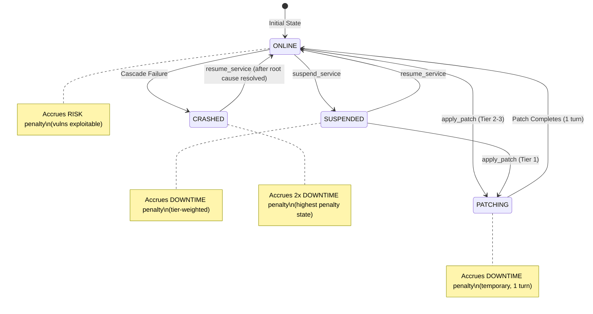
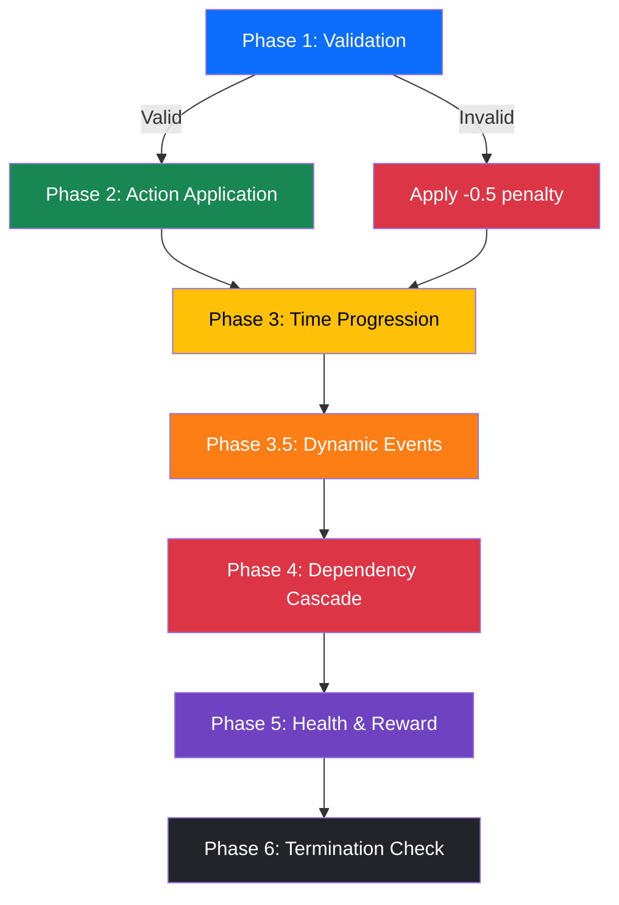
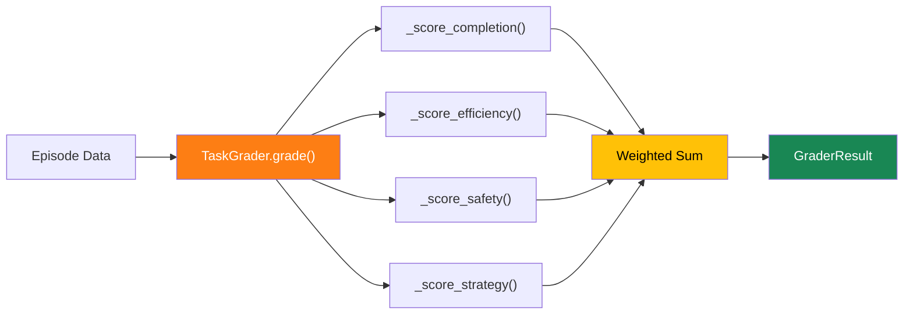

# 🏗️ Architecture Deep-Dive

## Design Philosophy

PatchCascade SOC is designed as **infrastructure for training AI agents**, not a demo. Every design decision prioritizes:

1. **Verifiability**: All rewards are computed algorithmically — no LLM-based judging
2. **Reproducibility**: Seeded random generation ensures identical episodes across runs
3. **Generalization**: Randomized node counts, vulnerability placements, and dynamic events prevent memorization
4. **Dense Signal**: Potential-based reward shaping provides learning feedback every turn

---

## State Machine



---

## Component Interaction

```
┌──────────────────────────────────────────────────────────────────┐
│                     Request Flow                                  │
│                                                                    │
│  Agent/LLM                                                        │
│     │                                                              │
│     ▼                                                              │
│  inference.py ──► client.py ──► server.py ──► environment.py      │
│     │               │             │              │                │
│     │               │             │              ▼                │
│     │               │             │           models.py           │
│     │               │             │              │                │
│     │               │             ▼              │                │
│     │               │          grader.py ◄───────┘                │
│     │               │             │                               │
│     ▼               ▼             ▼                               │
│  [START]/[STEP]/[END] output   tasks/                             │
│                                                                    │
└──────────────────────────────────────────────────────────────────┘
```

---

## Step Processing Pipeline

Each call to `environment.step(action)` executes 6 phases in strict order:



### Phase 3.5: Dynamic Events (New)

This phase handles two advanced mechanics:

1. **Exploit Spreading**: For each `exploit_in_wild` vulnerability, if it remains unpatched on an ONLINE node for 4+ consecutive turns, it spreads to a randomly selected connected node via the dependency graph.

2. **Zero-Day Injection**: In `zero_day` mode, at predefined turns (5 and 15), new CVEs are injected into the vulnerability list with appropriate severity and affected hosts.

---

## Grading Architecture



Each task uses customized weight profiles:

| Task | Completion | Efficiency | Safety | Strategy |
|------|-----------|-----------|--------|----------|
| Easy | 40% | 20% | 20% | 20% |
| Medium | 40% | 20% | 20% | 20% |
| Hard | 40% | 20% | 20% | 20% |
| Incident Response | 30% | 15% | **35%** | 20% |
| Zero-Day | 35% | **30%** | 15% | 20% |

---

## Why These Design Choices?

### Dense Rewards Over Sparse
Sparse rewards (win/lose at episode end) make credit assignment extremely difficult. Our potential-based shaping provides feedback every turn while maintaining the same optimal policy.

### Multi-Dimensional Grading Over Single Metric
A single normalized reward doesn't capture *how* an agent succeeded. An agent that causes 10 cascades but recovers is fundamentally different from one that avoids cascades entirely. Our 4-dimension system distinguishes these cases.

### Dynamic Events Over Static Scenarios
Static environments allow agents to memorize solutions. Dynamic exploit spreading and zero-day injection force generalization and adaptive planning — skills critical for real-world deployment.

### JSON Observations Over Numeric Arrays
LLM agents natively understand JSON with semantic field names. Our Pydantic models include rich `Field(description=...)` annotations that serve as documentation directly in the schema, enabling zero-shot agent performance.
