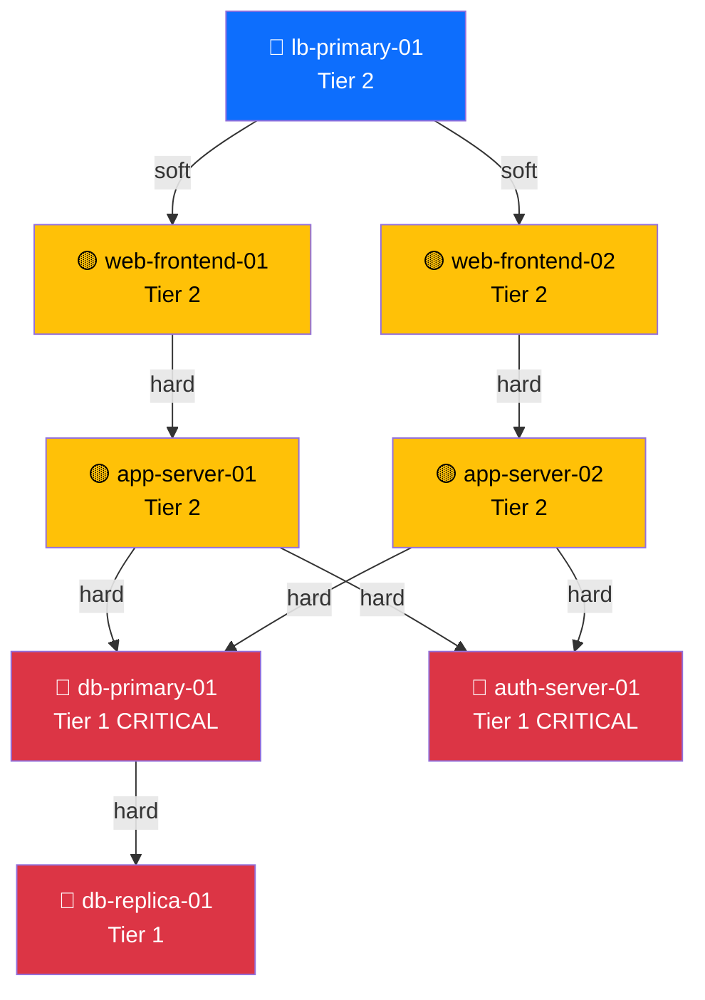
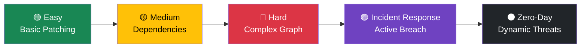
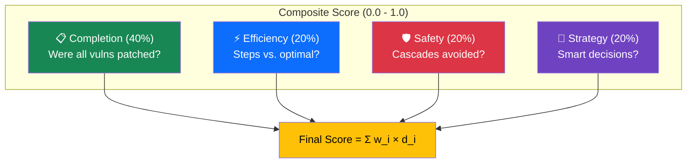
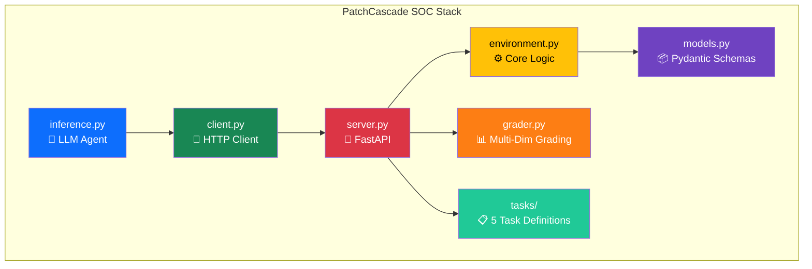

<div align="center">

# 🛡️ PatchCascade SOC

### *Autonomous Cyber-Resilience Through Reinforcement Learning*

[](https://huggingface.co/spaces)
[](https://python.org)
[](https://fastapi.tiangolo.com)
[](https://docker.com)
[](.)
[](LICENSE)

**Train AI agents to manage vulnerability patches across enterprise networks—without crashing production.**

[Quick Start](#-quick-start) • [The Challenge](#-the-challenge) • [Architecture](#-architecture) • [Grading Logic](#-multi-dimensional-grading) • [API Reference](#-api-reference) • [Contributors](#-contributors)

</div>

---

## 🔬 Research Motivation

Modern enterprise networks face a critical unsolved problem: **how to autonomously patch security vulnerabilities without causing service outages**. This is a fundamentally sequential decision-making problem with:

- **Dependency-aware constraints**: Patching node A may crash nodes B, C, D
- **Multi-objective optimization**: Minimize both security risk AND downtime
- **Dynamic threat landscapes**: New zero-day vulnerabilities emerge unpredictably
- **Cascading failure risks**: One wrong action can take down entire infrastructure

PatchCascade SOC provides a **research-grade RL environment** that captures the full complexity of this problem. Unlike toy grid-worlds or game environments, PatchCascade models real SOC workflows with:

1. **Realistic network topologies** with tiered criticality and service dependencies
2. **CVSS-based vulnerability scoring** matching industry-standard severity ratings
3. **Dense reward shaping** that provides continuous learning signal
4. **Dynamic events** including exploit spreading and zero-day injection
5. **Multi-dimensional evaluation** across completion, efficiency, safety, and strategy

This environment is designed to train agents that could eventually assist human SOC analysts in making high-stakes patching decisions.

### 📚 Theoretical Foundation

Our reward design implements **potential-based reward shaping** (Ng, Harada & Russell, 1999), which provides dense learning signal while preserving optimal policy invariance. The key insight is:

```
R'(s, a, s') = R(s, a, s') + γΦ(s') - Φ(s)
```

The corrected environment defines `Φ(s) = -total_penalty(s)`, uses `γ = 0.99`
in both PPO and shaping, and sets terminal-state potential to zero. Under those
conditions the shaping term preserves the optimal policies of the explicitly
defined base reward (time cost, invalid-action cost, and terminal outcome). The
pre-hardening implementation used an undiscounted penalty difference with a
`γ=0.99` learner and therefore did **not** justify this guarantee; models trained
under that older reward schema are not canonical-v1 evidence.

**Key References:**
- Ng, A. Y., Harada, D., & Russell, S. (1999). *Policy invariance under reward transformations*. ICML.
- Sutton, R. S., & Barto, A. G. (2018). *Reinforcement Learning: An Introduction*. MIT Press.
- Mnih, V., et al. (2015). *Human-level control through deep reinforcement learning*. Nature.

---

## 🎯 The Problem: The Patching Paradox

> *"Every unpatched CVE is a ticking time bomb. But every patch is a potential outage."*

Security teams face an impossible tradeoff:

| **Patch Immediately** | **Delay Patching** |
|----------------------|-------------------|
| ✅ Fixes vulnerability | ❌ Leaves exploit window open |
| ❌ Causes service downtime | ✅ Maintains uptime |
| ❌ Risk of cascade failures | ❌ Risk of breach |
| ❌ Angry customers | ❌ Angry regulators |

**The real nightmare?** Modern infrastructure has *dependencies*. Patch your database, and suddenly your web servers crash. Take down authentication, and your entire stack follows. One wrong move triggers a **cascade failure** that costs millions.

**PatchCascade SOC** trains AI agents to navigate this paradox—learning to patch vulnerabilities *in the optimal order* while minimizing downtime and avoiding catastrophic cascades.

---

## 💡 Why PatchCascade?

| Feature | Traditional RL Envs | PatchCascade SOC |
|---------|--------------------:|:-----------------|
| **Observation Space** | Numeric arrays | Rich JSON with semantic meaning |
| **Action Space** | Discrete indices | Named actions with parameters |
| **Reward Signal** | Sparse (win/lose) | Dense (continuous feedback) |
| **Real-World Mapping** | Abstract | Direct SOC workflow simulation |
| **LLM Compatibility** | Requires embedding | Native JSON schema descriptions |
| **Dependency Modeling** | None | Full cascade simulation |
| **Dynamic Events** | Static scenarios | Exploit spreading + zero-day injection |
| **Evaluation** | Single metric | Multi-dimensional (4 axes) |
| **Task Curriculum** | 1-2 levels | 5 progressive difficulty levels |

---

## ✨ Feature Highlights

### 🏢 **Tiered Asset Management**
Not all servers are equal. Our environment models real-world criticality:

| Tier | Type | Examples | Downtime Penalty | Patch Rules |
|------|------|----------|------------------|-------------|
| **1** | 🔴 CRITICAL | Databases, Auth Servers | **3x** multiplier | Must SUSPEND before patching |
| **2** | 🟡 IMPORTANT | Web Servers, APIs | **2x** multiplier | Can patch while ONLINE |
| **3** | 🟢 STANDARD | Dev Servers, Monitoring | **1x** multiplier | Can patch while ONLINE |

### 🔗 **Dynamic Dependency Graph**
Real-time cascade failure simulation with hard and soft dependencies:



> ⚠️ **If DB-Primary goes OFFLINE → App servers CRASH → Web servers CASCADE CRASH**

### 📊 **CVSS-Driven Risk Scoring**
Vulnerabilities are modeled with real-world severity metrics:

- **CVSS 9.0-10.0** (CRITICAL): Remote code execution, zero-click exploits
- **CVSS 7.0-8.9** (HIGH): Privilege escalation, data exfiltration  
- **CVSS 4.0-6.9** (MEDIUM): DoS, information disclosure
- **Exploit in Wild**: **2x penalty multiplier** for actively exploited CVEs

### 🦠 **Exploit Spreading** *(Advanced Mechanic)*
In `incident_response` and `hard` modes, exploited CVEs that remain unpatched on ONLINE nodes for 4+ turns **spread to connected nodes** via the dependency graph. This creates urgency and rewards proactive patching.

### 💣 **Dynamic Zero-Day Injection** *(Advanced Mechanic)*
In `zero_day` mode, new CVEs are injected mid-episode:
- **Turn 5**: CRITICAL zero-day (CVSS 9.9, actively exploited)
- **Turn 15**: HIGH severity CVE (CVSS 8.4)

The agent must dynamically adapt its strategy when new threats emerge.

### 🎮 **Dense Reward Shaping**
Unlike sparse-reward environments, PatchCascade provides continuous feedback:

```
Reward = BaseReward + 0.99 × Φ(Current State) - Φ(Previous State)

Where Φ(State) = -(Risk_Penalty + Downtime_Penalty)
and BaseReward includes the -0.1 time cost, invalid-action cost, and terminal outcome.
True terminal states use Φ=0; time-limit truncations retain the observed state potential.
```

| Event | Reward Impact |
|-------|--------------:|
| Patch a CRITICAL vuln | **+9.0 to +19.6** (doubled if exploit active) |
| Cause a cascade crash | **-6.0 to -12.0** per crashed node |
| Invalid action | **-0.5** penalty |
| Victory (all patched) | **+50.0** bonus |
| Catastrophic failure | **-100.0** penalty |

---

## 📐 Mathematical Formulation

### State Space

The environment state at turn *t* is defined as:

```
S_t = (N, V_t, D, H_t)

N = {n_i} — Set of server nodes with (hostname, tier, state, services)
V_t = {v_j} — Set of active vulnerabilities at turn t
D = {d_k} — Dependency graph edges (immutable)
H_t — Aggregate health metrics at turn t
```

### Reward Function

The reward at each step uses **potential-based reward shaping**:

```
  R'_t = R_base,t + γ Φ(S_t) - Φ(S_{t-1})

Where:
  γ = 0.99
  Φ(S) = -(Risk_Penalty(S) + Downtime_Penalty(S))
  
  Risk_Penalty = Σ_j [ cvss_j × |affected_online_j| × (2 if exploit_in_wild_j else 1) ]
  
  Downtime_Penalty = Σ_i [ tier_mult(n_i) × (2 if crashed(n_i) else 1) ]   ∀ n_i ∉ ONLINE
  
  R_base,t = -0.1 + invalid-action penalty (if any) + terminal outcome (if any)
  
  R_terminal = { +50 if all vulns patched,  -100 if all nodes crashed,  0 otherwise }
```

This normally provides dense feedback, but no claim is made that every numerical
transition must be non-zero. Policy-invariance applies only to the corrected
reward schema and matching discount/terminal handling described above.

### Normalization

Final scores are normalized to [0, 1] for comparability:

```
Score = clamp((Σ R_t - R_min) / (R_max - R_min), 0.001, 0.999)

Where R_min = -300.0, R_max = 50.0
```

---

## 🎮 The Challenge: 5-Level Task Curriculum

PatchCascade offers **five progressive difficulty levels**, each building on the skills learned in previous levels:



### 🟢 Level 1: Easy Mode
> *"Learn the basics"*

| Parameter | Value |
|-----------|-------|
| Nodes | 3-5 servers |
| Dependencies | None |
| Vulnerabilities | 1 (Medium/High) |
| Max Turns | 30 |
| Key Skill | Basic patch sequencing |

### 🟡 Level 2: Medium Mode
> *"Handle dependencies"*

| Parameter | Value |
|-----------|-------|
| Nodes | 5-8 servers |
| Dependencies | Linear chain (Web → App → DB) |
| Vulnerabilities | 2 (including 1 on Tier 1) |
| Max Turns | 50 |
| Key Skill | Suspend-patch-resume workflow |

### 🔴 Level 3: Hard Mode
> *"Survive the chaos"*

| Parameter | Value |
|-----------|-------|
| Nodes | 10-15 servers |
| Dependencies | Complex graph (LB → Web → App → DB + Auth) |
| Vulnerabilities | 5 (2 actively exploited CRITICAL) |
| Max Turns | 100 |
| Key Skill | Multi-objective optimization under pressure |

### 🟣 Level 4: Incident Response *(New!)*
> *"Triage an active breach"*

| Parameter | Value |
|-----------|-------|
| Nodes | 8 servers (2 pre-CRASHED) |
| Dependencies | Complex with hard + soft edges |
| Vulnerabilities | 3 (2 actively exploited, spreading!) |
| Max Turns | 60 |
| Key Mechanic | **Exploit spreading** — unpatched exploited CVEs infect connected nodes every 4 turns |
| Key Skill | Damage assessment, recovery-under-pressure, threat containment |

### ⚫ Level 5: Zero-Day Cascade *(New!)*
> *"Adapt or die"*

| Parameter | Value |
|-----------|-------|
| Nodes | 10 servers |
| Dependencies | Multi-layer (Web → Gateway → App → DB/Auth) |
| Vulnerabilities | 2 initial + **2 dynamically injected** |
| Max Turns | 80 |
| Key Mechanic | **Zero-day injection** — new CRITICAL CVE at turn 5, HIGH CVE at turn 15 |
| Key Skill | Adaptive planning, strategy revision, reprioritization |

---

## 📊 Multi-Dimensional Grading

Unlike simple pass/fail or single-metric grading, PatchCascade evaluates agents across **four orthogonal dimensions**:



| Dimension | Weight | What It Measures | Perfect Score |
|-----------|--------|-----------------|---------------|
| **Completion** | 40% | Fraction of vulnerabilities patched | All CVEs resolved |
| **Efficiency** | 20% | Steps taken vs. theoretical minimum | Completed at or near optimal_steps |
| **Safety** | 20% | Cascade failures avoided | Zero cascade failures |
| **Strategy** | 20% | Decision quality (exploit priority, dependency ordering, action validity) | Exploited CVEs patched first, correct suspend order |

> **Note**: Weights vary by task type. Incident Response uses **safety-focused** weights (35% safety), while Zero-Day uses **efficiency-focused** weights (30% efficiency).

### Scoring Examples

| Agent Behavior | Completion | Efficiency | Safety | Strategy | **Final** |
|---------------|-----------|-----------|--------|----------|-----------|
| Perfect optimal agent | 1.00 | 1.00 | 1.00 | 1.00 | **1.000** |
| Patches everything, slowly | 1.00 | 0.40 | 1.00 | 0.80 | **0.84** |
| Fast but causes cascades | 0.80 | 0.90 | 0.30 | 0.50 | **0.60** |
| Random agent | 0.20 | 0.10 | 0.30 | 0.30 | **0.22** |

---

## 🏗️ Architecture



| Component | Purpose |
|-----------|---------| 
| `models.py` | Pydantic schemas with rich `Field()` descriptions for LLM comprehension |
| `environment.py` | Core state machine: reset, step, cascade logic, dynamic events, reward calculation |
| `server.py` | FastAPI wrapper exposing `/reset`, `/step`, `/observation`, `/grade` endpoints |
| `grader.py` | Multi-dimensional programmatic graders (completion, efficiency, safety, strategy) |
| `tasks/` | 5 task definitions with individual grader configurations and success criteria |
| `client.py` | Async HTTP client with type-safe request/response handling |
| `inference.py` | Baseline LLM agent using OpenAI-compatible API |

---

## 🚀 Quick Start

### Option 1: Docker (Recommended)

```bash
# Build the container
docker build -t patchcascade-soc .

# Run the server
docker run -p 8000:8000 patchcascade-soc

# Test the endpoint
curl -X POST http://localhost:8000/reset \
  -H "Content-Type: application/json" \
  -d '{"task_level": "medium"}'
```

### Option 2: Local Development

```bash
# Install dependencies
pip install -r requirements.txt

# Start the server
uvicorn server:app --host 0.0.0.0 --port 8000 --reload

# Run the baseline agent
export HF_TOKEN="your_huggingface_token"
export MODEL_NAME="Qwen/Qwen2.5-72B-Instruct"
python inference.py
```

### Validate a Deployed Space

```bash
bash validate-deployment.sh https://your-space.hf.space
```

### 🎬 Sample Interaction

```python
from client import PatchCascadeLocalClient, PatchCascadeAction

# Initialize local client (no server needed)
client = PatchCascadeLocalClient()

# Try the new Incident Response mode!
obs = client.reset(task_level="incident_response")

print(f"Nodes: {[n.hostname for n in obs.nodes]}")
print(f"Crashed: {[n.hostname for n in obs.nodes if n.state == 'crashed']}")
print(f"Vulns: {[v.cve_id for v in obs.vulnerabilities]}")
print(f"Messages: {obs.messages}")
# Output: "⚠️ ACTIVE BREACH: Multiple nodes are already compromised..."

# Recover a crashed node first
from models import ActionType
action = PatchCascadeAction(
    action_type=ActionType.RESUME_SERVICE,
    target="db-primary-01",
    reason="Recover crashed database to restore app layer"
)
result = client.step(action)
print(f"Reward: {result.reward:.2f}, Done: {result.done}")
```

### 🖥️ Rich ASCII Visualization

The environment provides a beautiful ASCII network diagram for debugging:

```
╔════════════════════════════════════════════════════════════════════╗
║        🛡️ PatchCascade SOC — Turn 5/50 (Incident Response)         ║
╠════════════════════════════════════════════════════════════════════╣
║  NETWORK TOPOLOGY                                                  ║
║                                                                    ║
║  🟢 db-primary-0 [ ONLINE ] T1 ⚠️    🔴 app-server-0 [CRASHED ] T2 🔥║
║  🟢 web-frontend [ ONLINE ] T2 ⚠️    🟡 cache-redis- [SUSPENDED] T3  ║
║  🔵 auth-server- [PATCHING] T2       🟢 api-gateway  [ ONLINE ] T2  ║
║                                                                    ║
║  DEPENDENCIES                                                      ║
║    web-fronte ━━► app-server                                       ║
║    app-server ━━► db-primary                                       ║
║    auth-serve ━━► db-primary                                       ║
║                                                                    ║
╠════════════════════════════════════════════════════════════════════╣
║  VULNS: 3 active (1 CRIT, 2 HIGH) (1 exploited!)                   ║
║  HEALTH: 4/6 online | 1 crashed | Risk: 12.5 | Downtime: 8.0       ║
║  REWARD: +15.50 (last: +3.20)                                      ║
╚════════════════════════════════════════════════════════════════════╝
```

**Legend:** 🟢 Online | 🔴 Crashed | 🟡 Suspended | 🔵 Patching | ⚠️ Has vulnerability | 🔥 Exploited

---

## 🎯 Example: Optimal Agent Strategy (Medium Mode)

Here's a step-by-step walkthrough of an optimal agent solving the medium task:

```
Turn 0: Observe — 6 nodes, 2 CVEs (db-primary-01 has CVE-2024-2001, web frontends have CVE-2024-2002)
         Dependencies: web → app → db-primary-01

Turn 1: suspend_service(web-frontend-01)    — Protect from cascade
Turn 2: suspend_service(web-frontend-02)    — Protect from cascade  
Turn 3: suspend_service(app-server-01)      — Protect from cascade
Turn 4: suspend_service(app-server-02)      — Protect from cascade
Turn 5: suspend_service(db-primary-01)      — Required: Tier 1 must be SUSPENDED
Turn 6: apply_patch(db-primary-01, CVE-2024-2001) — Patch critical DB vuln
         [Patch completes next turn → db-primary-01 returns to ONLINE]
Turn 7: resume_service(app-server-01)       — DB is online, safe to resume
Turn 8: resume_service(app-server-02)       — Resume second app server
Turn 9: resume_service(web-frontend-01)     — Resume web (still has CVE-2024-2002)
Turn 10: apply_patch(web-frontend-01, CVE-2024-2002) — Patch web vuln
Turn 11: resume_service(web-frontend-02)
Turn 12: apply_patch(web-frontend-02, CVE-2024-2002) — Patch second web server

Result: All patched in 12 steps, 0 cascade failures, 0 invalid actions
Score: completion=1.0, efficiency=0.85, safety=1.0, strategy=1.0 → Final: 0.95
```

---

## 📡 API Reference

### `POST /reset`
Initialize a new episode.

```json
// Request
{ "task_level": "incident_response", "seed": 42 }

// Response
{ "observation": { "nodes": [...], "vulnerabilities": [...], ... } }
```

### `POST /step`
Execute an action.

```json
// Request
{
  "action_type": "apply_patch",
  "target": "web-frontend-01",
  "cve_id": "CVE-2024-1234"
}

// Response
{
  "observation": { ... },
  "reward": 7.5,
  "done": false,
  "truncated": false,
  "info": { "valid": true, "cascade_failures": 0, "total_cascade_failures": 0 }
}
```

### `GET /tasks`
List all 5 tasks with grader information.

### `POST /grade/{task_id}`
Grade an episode using multi-dimensional programmatic grading.

### `GET /metadata`
Get full environment metadata including all tasks, graders, and schemas.

### Action Types

| Action | Target Required | CVE Required | Effect |
|--------|----------------|--------------|--------|
| `scan_host` | ✅ | ❌ | Inspect node details |
| `suspend_service` | ✅ | ❌ | Gracefully offline node |
| `apply_patch` | ✅ | ✅ | Fix vulnerability (1 turn) |
| `resume_service` | ✅ | ❌ | Bring node back online |
| `noop` | ❌ | ❌ | Skip turn |

---

## 🧠 Agent Strategy Tips

1. **Suspend dependents first**: Before patching a Tier 1 node, suspend all nodes that depend on it
2. **Prioritize exploited CVEs**: `exploit_in_wild=true` means 2x risk penalty per turn — and in advanced modes, they **spread** to connected nodes
3. **Batch patches efficiently**: While one node is PATCHING, work on independent branches
4. **Don't fear downtime**: A controlled SUSPENDED state is better than an uncontrolled CRASH
5. **Watch for dynamic events**: In zero-day mode, new CVEs appear at turns 5 and 15 — be ready to reprioritize
6. **Recover before patching**: In incident response mode, crashed nodes must be resumed before they can be patched

---

## 📈 Evaluation Metrics

| Metric | Description | Goal |
|--------|-------------|------|
| **Composite Score** | Weighted multi-dimensional score | Maximize (0.0-1.0) |
| **Completion** | % of vulnerabilities patched | Maximize |
| **Efficiency** | Steps vs. theoretical optimum | Minimize steps |
| **Safety** | Cascade failures avoided | Zero cascades |
| **Strategy** | Decision quality | Maximize |

### 📊 Agent Benchmark Results

We evaluate four agent types across all five task levels using our multi-dimensional grading system.
Scores are composite (Completion × Efficiency × Safety × Strategy), normalized to [0.0, 1.0].

> The table below is a historical, pre-canonical snapshot. The old benchmark did
> not predeclare matched episode seeds and is **not canonical evidence**. Do not
> compare new PPO claims against it as though it were a frozen test result.

| Agent | Easy | Medium | Hard | IR | Zero-Day | Avg |
|-------|:----:|:------:|:----:|:--:|:--------:|:---:|
| **Random** | 0.80 | 0.42 | 0.32 | 0.37 | 0.43 | **0.47** |
| **Heuristic** | 0.95 | 0.89 | 0.79 | 0.74 | 0.95 | **0.86** |
| **PPO (RL-trained)** | *TBD* | *TBD* | *TBD* | *TBD* | *TBD* | *TBD* |
| **LLM Agent** | *TBD* | *TBD* | *TBD* | *TBD* | *TBD* | *TBD* |

> **Note:** `train_rl.py` is retained for historical/interactive experiments.
> [`training_specs/canonical_v1.json`](training_specs/canonical_v1.json) is a
> corrected provisional baseline, not the final highest-quality experiment.
> Held-out seeds remain sealed until the bounded validation-only process in
> [`MODEL_SELECTION_PROTOCOL.md`](MODEL_SELECTION_PROTOCOL.md) produces a new,
> reviewed `frozen-final-selected` spec. Only the frozen development/model-selection
> campaign is currently authorized; final, canonical, and confirmation compute are not.
> The locked runner first performs an equal-budget, paired validation-only
> MultiDiscrete PPO versus MaskablePPO decision, then applies the bounded
> hyperparameter campaign to the mechanical winner; neither interface has a
> claimed result in this PR.

### 🏋️ Train Your Own Agent

PatchCascade includes a Gymnasium-compatible wrapper for seamless integration with standard RL libraries:

```python
# Quick training with Stable-Baselines3
from gym_wrapper import PatchCascadeGymEnv
from stable_baselines3 import PPO

env = PatchCascadeGymEnv(task_level="medium")
model = PPO("MlpPolicy", env, verbose=1)
model.learn(total_timesteps=50_000)
```

For the contributor-safe sequence—exact-lock preflight, safe-boundary automatic resume, trusted-runtime-state handling, matched held-out
evaluation, verification, and submission bundle—follow
[`TRAINING_CONTRIBUTION_GUIDE.md`](TRAINING_CONTRIBUTION_GUIDE.md). Contributors
do not edit seeds or hyperparameters; the version-controlled spec supplies them.
Artifact integrity and policy acceptance are separate: a complete negative run is
retained as evidence, while the verifier refuses a success label unless every
held-out per-task quality and safety gate passes on both frozen test splits.

---

## Training & Reproducibility Contributors

Accepted independent runs retain Git/PR attribution and may be listed here with
immutable artifact links and research/reproduction credit appropriate to the work.
See [`TRAINING_CONTRIBUTION_GUIDE.md`](TRAINING_CONTRIBUTION_GUIDE.md) and
[issue #2](https://github.com/Ayush-Kumar0207/PatchCascade-SOC/issues/2).
No payment, employment implication, or GitHub-controlled achievement is promised.

---

## 📄 License

Apache 2.0 — See [LICENSE](LICENSE) for details.

---

## 👥 Contributors

<table>
  <tr>
    <td align="center">
      <a href="https://github.com/Ayush-Kumar0207">
        <br/>
        <sub><b>Ayush Kumar</b></sub>
      </a><br/>
      <sub>🚀 Team Lead | Core Builder</sub>
    </td>
    <td align="center">
      <a href="https://github.com/cypher00grd">
        <br/>
        <sub><b>Ravi Prashant</b></sub>
      </a><br/>
      <sub>🏗️ Architect and Developer</sub>
    </td>
  </tr>
</table>

---

## 🛠️ Built With

| Technology | Purpose |
|------------|---------|
| **Python 3.11+** | Core language |
| **Pydantic v2** | Data validation & serialization |
| **FastAPI** | High-performance async API |
| **Uvicorn** | ASGI server |
| **Gymnasium** | Standard RL environment interface |
| **Stable-Baselines3** | RL training (PPO, A2C) |
| **Docker** | Containerization |
| **OpenAI SDK** | LLM integration |

---

## 🙏 Acknowledgments

- **Hugging Face** — For Spaces infrastructure
- **OpenEnv Community** — For the standardized RL environment protocol

---

<div align="center">

**Created by Ayush Kumar & Ravi Prashant**

*Train smarter. Patch faster. Crash never.*

Made with ❤️ in India

</div>
